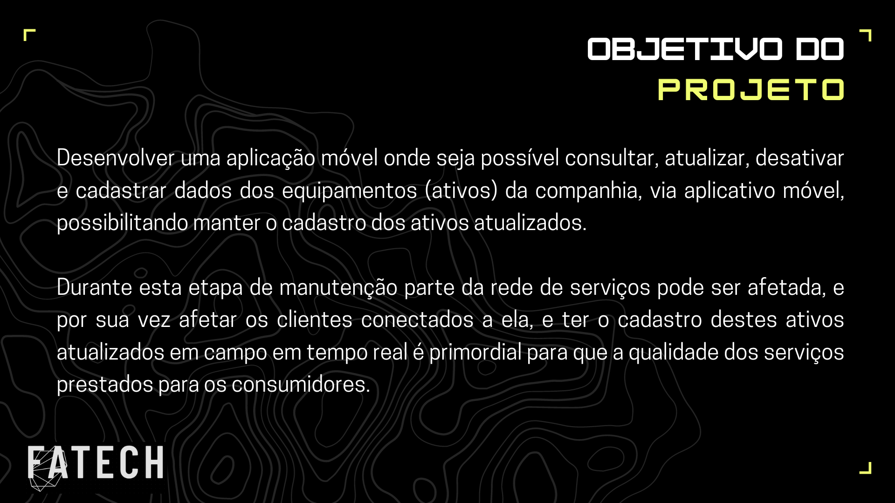
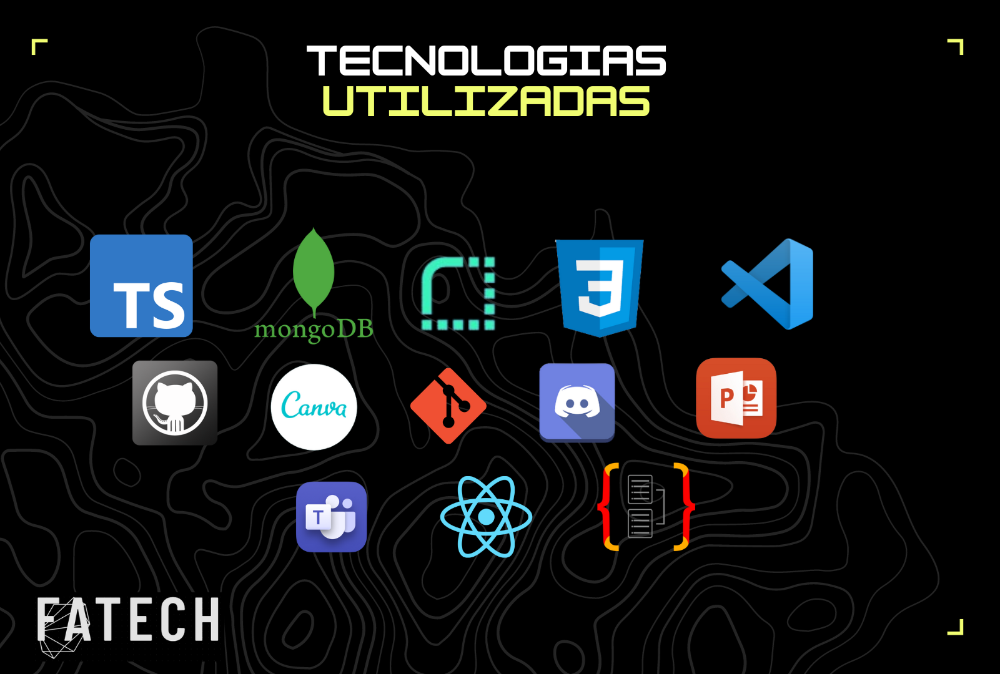
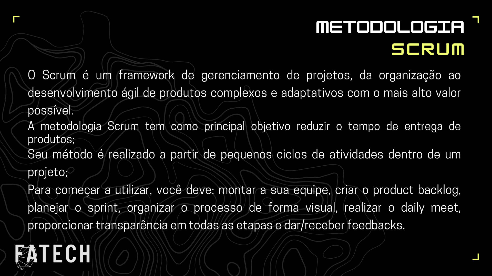
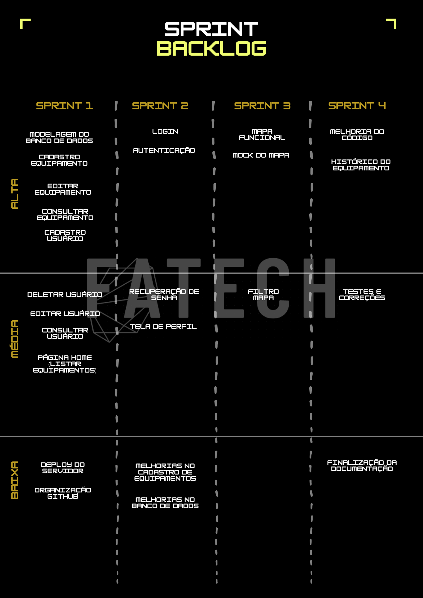

# API- Projeto Integrador 5º Semestre ADS - Grupo Fatech
Projeto desenvolvido por alunos do quinto semestre do curso de análise e desenvolvimento de sistemas da Fatec - SJC, durante o segundo semestre do ano de 2023.

## 📂 Repositório do Servidor
Devido a restrições do React Native, mantivemos o código do servidor em um repositório separado para que não houvessem conflitos.
- <a href="https://github.com/4-Fatech/API5Semestre-back"> Link do repositório </a>

## 🎯 Objetivo

O objetivo da aplicação móvel é proporcionar uma ferramenta essencial para as áreas de engenharia de empresas de Saneamento, Elétrica, Telecomunicações e outras corporações que realizam obras e manutenção em campo. 

Essa aplicação móvel tem a finalidade de permitir aos funcionários consultar, atualizar, desativar e cadastrar informações dos equipamentos ativos da companhia por meio de um aplicativo acessível em dispositivos móveis. 

Esta ferramenta desempenha um papel fundamental em processos de manutenção, nos quais a desativação temporária de um equipamento é necessária para a realização de reparos. Durante essas intervenções, partes da rede de serviços podem ser afetadas, impactando os clientes conectados a ela. Portanto, a capacidade de manter o cadastro de ativos atualizado em tempo real é crucial para garantir a qualidade dos serviços oferecidos aos consumidores. A aplicação móvel visa facilitar esse processo, proporcionando uma maneira eficiente e precisa de gerenciar informações essenciais dos equipamentos em campo.

> Status do Projeto: Em Desenvolvimento.

 

## 📩 Proposta
**Desenvolver um sistema web com os seguintes requisitos:**

> Requisitos Funcionais

- [X] A solução só deve liberar o acesso ao restante do sistema após o usuário ser autenticado.
- [X] O processo de recuperação de senha deve exigir a confirmação de um código de seis 
dígitos que será enviado por SMS ou e-mail para que o usuário informe antes de modificar 
a senha.
- [X] Os dados de cadastro do usuário devem ser: NOME (texto, 50), SOBRENOME (texto, 50), 
EMAIL (texto, 120), TELEFONE (2longo, 15), MATRICULA (texto, 10), CPF (longo, 12).
- [X] O usuário pode ter uma foto associada a seu cadastro.
- [X] A senha deve conter caracteres alfanuméricos sendo ao menos um deles maiúsculo, e um 
minúsculo [A..Z – a..z], e deve conter números [0..9] e símbolos [ !@#$_ ].
- [X] A senha deve ter comprimento mínimo de 10 caracteres e máximo de 20 caracteres.
- [X] A senha deve ser armazenada no banco de dados de forma criptografada, para evitar que 
em caso de vazamento de dados, o sistema não tenha o acesso comprometido.
- [X] Os dados de um equipamento devem ser: TIPO (inteiro, 5, domínio: tipo equipamento), ID 
(texto, 10), SERIAL (texto, 30), LATITUDE (duplo), LONGITUDE (duplo), OBSERVACOES 
(texto, 200).
- [X] Cada equipamento da base de dados pode ter 0 ou mais fotos associadas ao cadastro.
- [ ] O usuário deve ser capaz de pesquisar a lista de equipamentos disponíveis em um raio de 
até 10km de sua localização atual, comparando com os dados de coordenadas 
armazenados em banco.
- [ ] O usuário pode escolher visualizar os equipamentos de forma pontual em um mapa, 
através da visualização de pontos na localização de cada equipamento.
- [ ] Na visualização de mapas, é também exibida uma listagem dos equipamentos 
apresentados, e quando um item da lista é clicado, o ponto é destacado no mapa.
- [ ] Na visualização de mapas, o usuário pode pesquisar qual tipo de equipamento deseja 
visualizar.
- [X] O usuário pode ainda visualizar os detalhes de cada equipamento, selecionando as ações 
de DESATIVAR, quando o equipamento se mantém no cadastro, mas desativado e não 
fazendo mais parte da rede de ativos em serviço, ou ATIVAR para deixar o equipamento 
disponível novamente, indicando que ele está em operação.
- [X] Um equipamento desativado deve ser apresentado na lista de equipamentos pesquisada 
pelo usuário de forma acinzentada (desativada) permitindo somente que seja clicado para 
visualização dos detalhes de forma que possa ter seus atributos atualizados, ou para que 
seja reativado.
- [X] Na tela inicial pode ser feito o cadastramento de um novo equipamento, onde devem 
ser registradas todas as informações dele.
- [ ] Caso o dispositivo do usuário não esteja conectado, os dados devem ser salvos para que 
sejam sincronizados com o banco de dados corporativo posteriormente.

> Requisitos Não Funcionais

- [X]  A aplicação móvel será utilizada em campo, logo deve-se considerar que a interface pode 
ser utilizada em ambientes com muita claridade (sob a luz do sol) ou em ambientes com 
pouca luminosidade (abrigados da luz solar, chuvoso ou em ambiente noturno).
- [X] A aplicação móvel deve realizar a sincronia de dados, quando estiver online, em até 30 
segundos, para garantir que as informações de cadastro representem os dados mais reais 
possíveis da situação que ocorre em campo.
- [X] Os dados armazenados no dispositivo móvel devem ser protegidos de forma que caso o 
dispositivo seja perdido ou furtado, não seja possível acessar as informações sigilosas da 
empresa (como por exemplo o cadastro de equipamentos).
- [X] Deve existir um controle de autenticação nas aplicações para que não sejam realizados 
acessos não autorizados.
- [X] As informações de usuários, clientes e dados de equipamentos devem ser anonimizadas e 
só exibidas após usuário da aplicação estar autenticado.
- [X] Todos os atributos cadastrais da aplicação devem passar por validação de dados.
- [X] Deve ser realizada uma sincronia com o banco de dados corporativo através de uma API 
que receberá os dados e o armazenará no banco de dados.
- [ ] Quando os dados forem sincronizados, o banco de dados mobile deve ser limpo para que 
sejam realizadas novas atividades de inspeção e cadastramento em campo.
- [X] O banco de dados mobile deve armazenar somente os dados que foram atualizados dos 
equipamentos cadastrados no banco de dados.
    
 ## 📅 Cronograma das Sprints 

 - - [X] <a href="https://github.com/4-Fatech/API5Semestre/tree/sprint_1">**1° Sprint:**</a> 04/09/2023 a 24/09/2023 
 - - [X] <a href="https://github.com/4-Fatech/API5Semestre/tree/sprint_2">**2° Sprint:**</a> 25/09/2023 a 15/10/2023
 - - [ ] <a href="">**3° Sprint:**</a> 16/10/2023 a 05/11/2023
 - - [ ] <a href="">**4°Sprint:**</a> 06/11/2023 a 26/11/2023
 - - [ ] **Feira de Soluções:** 12/12/2023
 
  
    
 ## 💻 Tecnologias Utilizadas

- **Back-end:** TypeScript, MongoDB Atlas, Render, NodeJS com o framework TypeORM.
- **Front-end:** TypeScript, React Native e CSS.
- **Ferramentas:** Visual Studio Code, Android Studio, Slack, Canva, Git, Github, PowerPoint, MySQL, Microsoft Teams e Discord.

## 💡 Metodologia

<ul> <li> <strong>Metodologia Ágil: SCRUM </strong> </li> </ul>
 

## 🗒️ Backlog Priorizado

 
 
## 👥 Equipe

| Nome             | Função        | GitHub                                                                    | Linkedin                                                                                                       |
| ---------------- | ------------- | ------------------------------------------------------------------------- | -------------------------------------------------------------------------------------------------------------- |
| Everton Ricardo  | Master        | <a href="https://github.com/Evertonrwr" target="_blank">Github</a>        | <a href="https://www.linkedin.com/in/everton-rocha-1a456b20b" target="_blank">Link</a>                         |
| Antônio Barbosa  | Product Owner | <a href="https://github.com/Antonio-Barbosa" target="_blank">Github</a>   | <a href="https://www.linkedin.com/in/antonio-marcelo-9a5b68181" target="_blank">Link</a>                       |
| André Ribeiro    | Desenvolvedor | <a href="https://github.com/New-Tomorrow" target="_blank">Github</a>      | <a href="https://www.linkedin.com/in/andre-ramos-ribeiro-320621226/" target="_blank">Link</a>                  |
| Bruna Dias       | Desenvolvedor | <a href="https://github.com/brunadias3" target="_blank">Github</a>        | <a href="https://www.linkedin.com/in/bruna-dias-977b611b9/" target="_blank">Link</a>                           |
| Dionísio Leão    | Desenvolvedor | <a href="https://github.com/dsslleagion" target="_blank">Github</a>       | <a href="https://www.linkedin.com/in/dionisio-samuel-dos-santos-le%C3%A3o-616848226/" target="_blank">Link</a> |
| Gabriel Coutinho | Desenvolvedor | <a href="https://github.com/Gabriel-Coutinho0" target="_blank">Github</a> | <a href="https://www.linkedin.com/in/gabriel-silva-b778a31aa" target="_blank">Link</a>                         |

 

## 🎥 Video Sprint Review 1
- <a href="https://youtu.be/7IwTFC6wEow" target="_blank">Link do vídeo</a>
 
